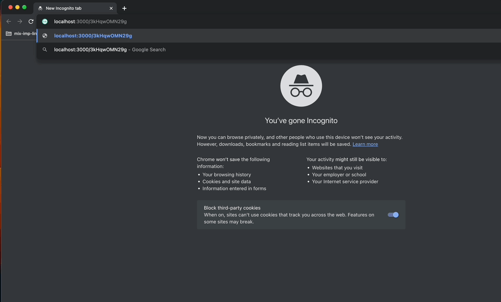

# URL-shortner
A URL shortener is a web service that takes a long and complex URL and compresses it to a short and clear link that is easier to share. Users are redirected to the primary URL when they click these short links.

## Installation

### Redis cache - setup & run  
docker must be installed & running
```bash
% docker run --name shortner-redis-cache -p 6389:6379 --restart always --detach redis
```

### Install golang

#### Mac
install golang on MacBook using brew 
```bash
% brew install go
```

### Install From Source

#### Step 1: Clone the repo

```bash
% git clone https://github.com/sohm22/short-url.git
```

#### Step 2: Build binary 
```bash
% cd api
% go build
```

#### Step 2: Run Backend Server
```bash
% ./short-url
```

## Usage

### Create a short url for long url
```bash
% curl --request POST \
  --url http://127.0.0.1:3000/api/v1 \
  --header 'Content-Type: application/json' \
  --data '{
        "URL" : "https://www.cricbuzz.com/live-cricket-scores/66022/mcr-vs-tre-23rd-match-the-hundred-mens-competition-2026"
}'
```
response from the server
```bash
{
  "url": "https://www.cricbuzz.com/live-cricket-scores/66022/mcr-vs-tre-23rd-match-the-hundred-mens-competition-2026",
  "short": "localhost:3000/3kHqwOMN29g",
  "expiry": 24,
  "rate_limit": 18,
  "rate_limit_reset": 30
}
```
### Using shorturl and redirecting it to long url


